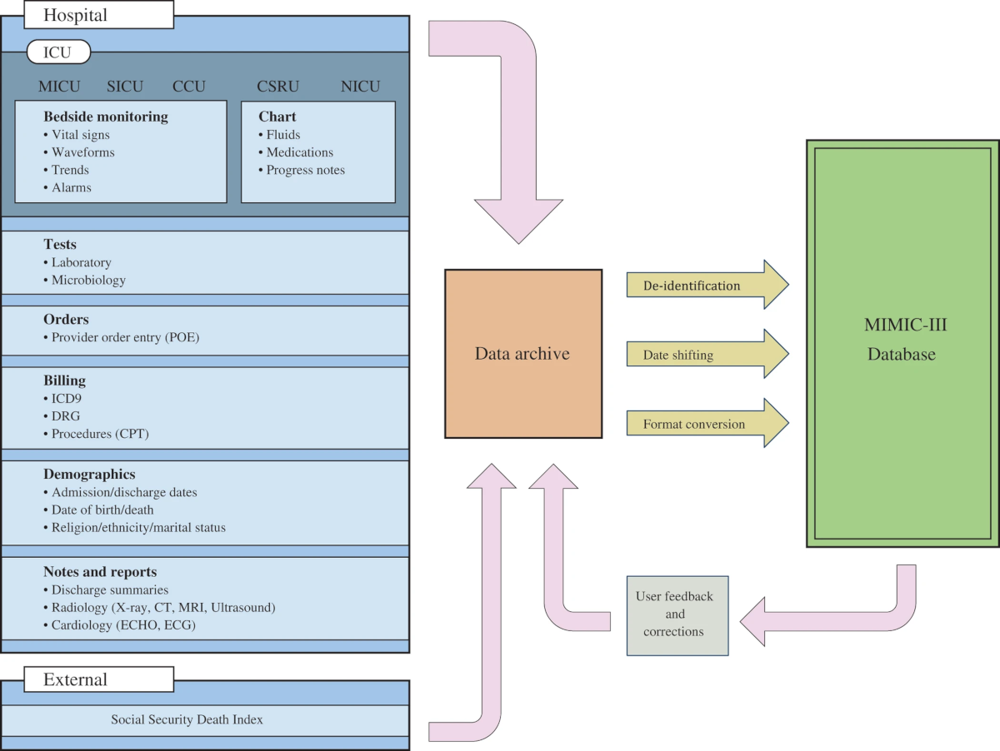

# Project Overview

### Dataset

The medical billing virtual assistant makes use of MIMIC-III dataset (1-4).  The description from physionet.org: "MIMIC-III is a large, freely-available database comprising deidentified health-related data associated with over forty thousand patients who stayed in critical care units of the Beth Israel Deaconess Medical Center between 2001 and 2012."

The data is a series of related tables that have anonymized patient data.  Using these tables, ICD-9 codes can be related to clinical note text.  The methodology for the creation of hte database is shown in the figure below (5).

The dataset can be found at the following location
https://physionet.org/content/mimiciii/1.4/

### Model

Natural language processing (NLP) is a rapidly advancing field.  Recent developments led to the creation of the BERT model (6).  BERT model pre-trains bidirectional representations of text resulting in word embeddings.  Since BERT was created, it has ushered in many domain-specific variants that have been trained on various corpora.  

Clinical BERT (7) was created by training both BERT and Bio-BERT on the MIMIC-III dataset, in order to create a language model more suitable for medical applications.  We rely upon the use of Clinical BERT for our model.  By using a fine-tuned model, trained on the ICD-9 codes, as well as relying upon the text embeddings from Clinical BERT, we are able to predict the incidence of ICD-9 codes from a given text.

#### Understanding BERT

A visual guide to BERT can be found at the following location: http://jalammar.github.io/illustrated-bert/.

The overall concept of BERT is to mask a random selection of tokens within the training text, and then attempt to predict these tokens.  Through this methodology, BERT achieved state of the art accuracy.

### Application Architecture

A brief summary of the model architecture:

1. A Flask REST API queries the clinical BERT model and provides the top predicted ICD-9 codes for the given text.
2. AWS Amplify hosts the JS + React front-end, and queries the business logic for the EM-code designations.

We make use of the following tools and technologies:

1. AWS
2. Docker / Docker-compose
3. AWS Amplify
4. React
5. Flask

The application architecture is shown in the image below:

### Use Cases

### References

1. Charles, D., King, J., Patel, V. & Furukawa, M. Adoption of Electronic Health record Systems among U.S. Non-federal Acute Care Hospitals. ONC Data Brief No. 9, 1–9 (2013).
2. Collins, F. S. & Tabak, L. A. NIH plans to enhance reproducibility. Nature 505, 612–613 (2014).
3. Johnson, A., Pollard, T., & Mark, R. (2016). MIMIC-III Clinical Database (version 1.4). PhysioNet. https://doi.org/10.13026/C2XW26.
4. Goldberger, A., Amaral, L., Glass, L., Hausdorff, J., Ivanov, P. C., Mark, R., ... & Stanley, H. E. (2000). PhysioBank, PhysioToolkit, and PhysioNet: Components of a new research resource for complex physiologic signals. Circulation [Online]. 101 (23), pp. e215–e220.
5. MIMIC-III, a freely accessible critical care database. https://www.nature.com/articles/sdata201635
6. Jacob Devlin, Ming-Wei Chang, Kenton Lee, Kristina Toutanova. BERT: Pre-training of Deep Bidirectional Transformers for Language Understanding. https://arxiv.org/abs/1810.04805.
7. Emily Alsentzer, John Murphy, William Boag, Wei-Hung Weng, Di Jin, Tristan Naumann, and Matthew McDermott. 2019. Publicly available clinical BERT embeddings. In Proceedings of the 2nd Clinical Natural Language Processing Workshop, pages 72-78, Minneapolis, Minnesota, USA. Association for Computational Linguistics. https://github.com/EmilyAlsentzer/clinicalBERT. https://huggingface.co/emilyalsentzer/Bio_ClinicalBERT. 
8. 
