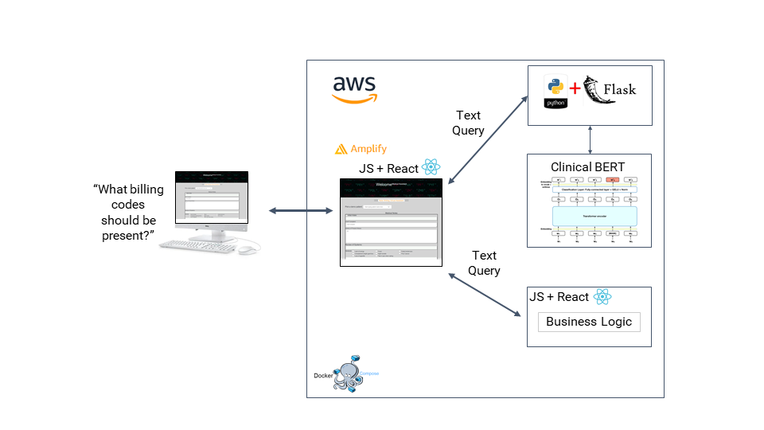
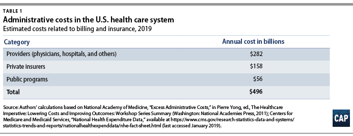
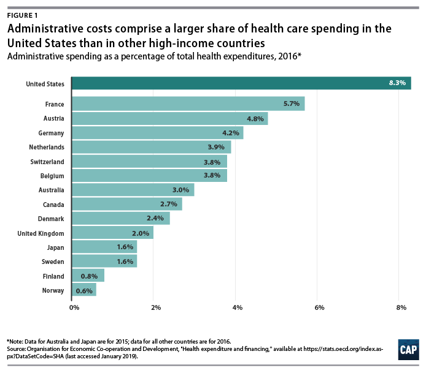
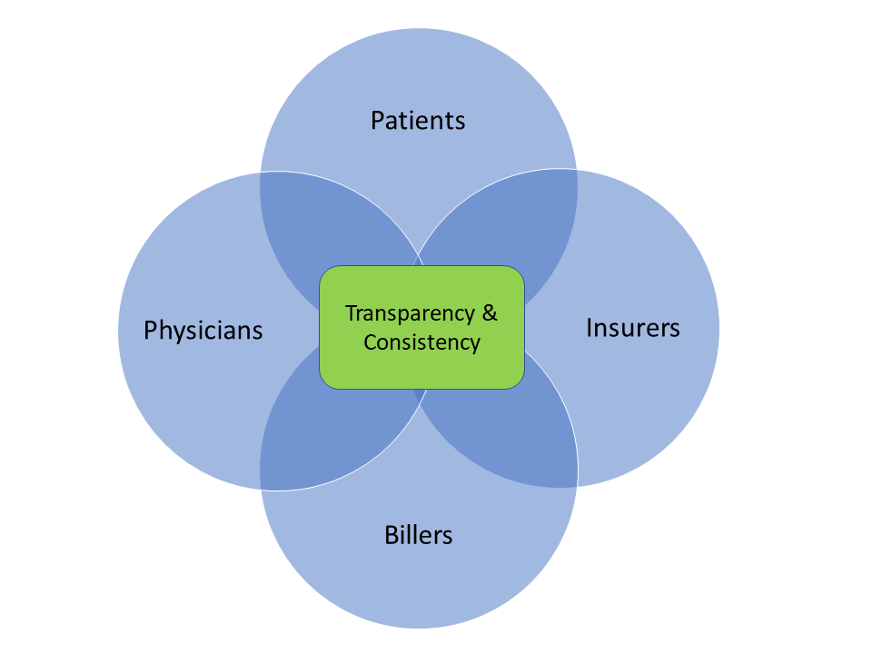

# Project Overview

### Dataset

The medical billing virtual assistant makes use of MIMIC-III dataset (1-4).  The description from physionet.org: "MIMIC-III is a large, freely-available database comprising deidentified health-related data associated with over forty thousand patients who stayed in critical care units of the Beth Israel Deaconess Medical Center between 2001 and 2012."

The data is a series of related tables that have anonymized patient data.  Using these tables, ICD-9 codes can be related to clinical note text.  The methodology for the creation of hte database is shown in the figure below (5).

The dataset can be found at the following location
https://physionet.org/content/mimiciii/1.4/

### Model

Natural language processing (NLP) is a rapidly advancing field.  Recent developments led to the creation of the BERT model (6).  BERT model pre-trains bidirectional representations of text resulting in word embeddings.  Since BERT was created, it has ushered in many domain-specific variants that have been trained on various corpora.  

Clinical BERT (7) was created by training both BERT and Bio-BERT on the MIMIC-III dataset, in order to create a language model more suitable for medical applications.  We rely upon the use of Clinical BERT for our model.  By using a fine-tuned model, trained on the ICD-9 codes, as well as relying upon the text embeddings from Clinical BERT, we are able to predict the incidence of ICD-9 codes from a given text.

#### Understanding BERT

A visual guide to BERT can be found at the following location: http://jalammar.github.io/illustrated-bert/.

The overall concept of BERT is to mask a random selection of tokens within the training text, and then attempt to predict these tokens.  Through this methodology, BERT achieved state of the art accuracy.

### Application Architecture

A brief summary of the model architecture:

1. A Flask REST API queries the clinical BERT model and provides the top predicted ICD-9 codes for the given text.
2. AWS Amplify hosts the JS + React front-end, and queries the business logic for the EM-code designations.

We make use of the following tools and technologies:

1. AWS
2. Docker / Docker-compose
3. AWS Amplify
4. React
5. Flask

The application architecture is shown in the image below:

### Background

Within the medical industry, there is a significant amount of waste (8).  Administrative costs in the US medical system amount of almost $500 billion annually!  Part of this problem is the complexity in the billing process.  Surprisingly, the use of electronic medical records (EMR) has resulted in physicians spending more time than ever on patient documentation!  

The US medical system has the most expensive administrative burden when compared to all other nations. It is estimated that lowering the administrative costs down to the level of Canada would result in $30 billion of annual savings.

With this background in mind, our goal is to improve the consistency and transparency associated with the billing process.  From a survey of subject matter experts (SMEs), the following results were consistently at the top of their list of complaints:

1. Billing is inefficient for physician time
2. Inconsistent coding for identical clinical work
3. Insurance rejection and audit risk creates additional documentation

### Use Cases

There are 4 main segments of the medical industry that have widely overlapping interests:

1. Patients
  a. No transparency when receiving bill for medical services.  However, patients have right to access their EMRs (9).
  b. No ability for patient to self-audit their medical bills.
2. Physicians
  a. Payout determined by documentation and coding
  b. Desire for uniformity of billing
3. Insurers
  a. Desire to audit suspicious billing practices
  b. Desire for uniformity of claims for identical clinical care
4. Billers
  a. Wish to reduce audit-risk and prevent resubmission of claims
  b. Desire for uniformity of billing for identical clinical care

There is considerable overlap in the parts of the healthcare industry for more transparency and uniformity.  

### Goal

1. Automatically and accurately identifying billing code based on medical documentation
2. AI writing assistant for physicians and medical workers

Any user can query their own medical records to understand the predicted medical billing codes.

### Benefits

1. Improve accuracy in medical bills
2. Decrease rejection rates by insurance companies, Medicare and Medicaid
3. Increase productivity of billing team
4. Reduce physician and nurse’s time on billing related activity
5. Allow patients to self-audit their medical records for suspicious billing

### References

1. Charles, D., King, J., Patel, V. & Furukawa, M. Adoption of Electronic Health record Systems among U.S. Non-federal Acute Care Hospitals. ONC Data Brief No. 9, 1–9 (2013).
2. Collins, F. S. & Tabak, L. A. NIH plans to enhance reproducibility. Nature 505, 612–613 (2014).
3. Johnson, A., Pollard, T., & Mark, R. (2016). MIMIC-III Clinical Database (version 1.4). PhysioNet. https://doi.org/10.13026/C2XW26.
4. Goldberger, A., Amaral, L., Glass, L., Hausdorff, J., Ivanov, P. C., Mark, R., ... & Stanley, H. E. (2000). PhysioBank, PhysioToolkit, and PhysioNet: Components of a new research resource for complex physiologic signals. Circulation [Online]. 101 (23), pp. e215–e220.
5. MIMIC-III, a freely accessible critical care database. https://www.nature.com/articles/sdata201635
6. Jacob Devlin, Ming-Wei Chang, Kenton Lee, Kristina Toutanova. BERT: Pre-training of Deep Bidirectional Transformers for Language Understanding. https://arxiv.org/abs/1810.04805.
7. Emily Alsentzer, John Murphy, William Boag, Wei-Hung Weng, Di Jin, Tristan Naumann, and Matthew McDermott. 2019. Publicly available clinical BERT embeddings. In Proceedings of the 2nd Clinical Natural Language Processing Workshop, pages 72-78, Minneapolis, Minnesota, USA. Association for Computational Linguistics. https://github.com/EmilyAlsentzer/clinicalBERT. https://huggingface.co/emilyalsentzer/Bio_ClinicalBERT. 
8. Excess Administrative Costs Burden the U.S. Health Care System. https://www.americanprogress.org/issues/healthcare/reports/2019/04/08/468302/excess-administrative-costs-burden-u-s-health-care-system/.
9. Individuals’ Right under HIPAA to Access their Health Information 45 CFR § 164.524. https://www.hhs.gov/hipaa/for-professionals/privacy/guidance/access/index.html#:~:text=With%20limited%20exceptions%2C%20the%20HIPAA,care%20providers%20and%20health%20plans.
